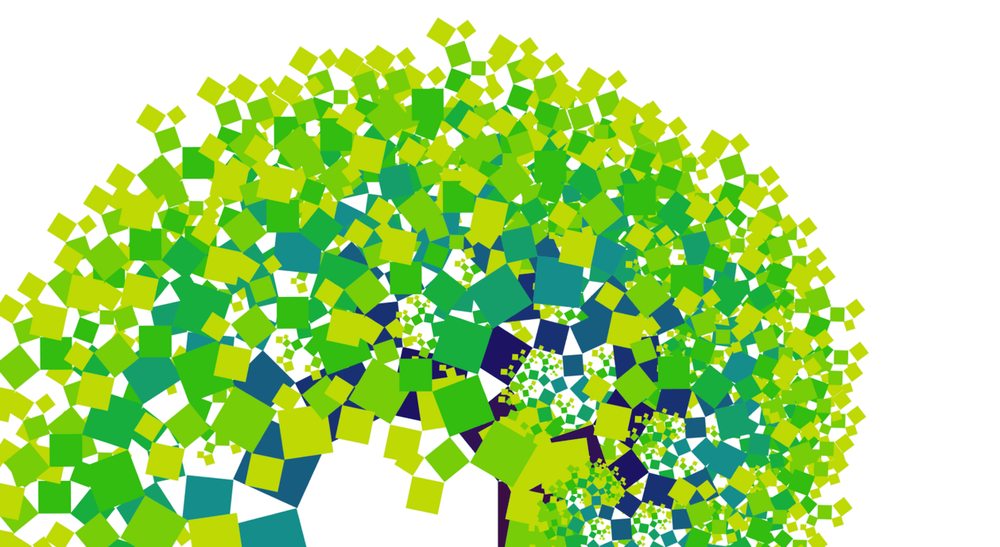

# CSS-fractal
> A proof of concept to show the *elegance* of css. [See the demo](https://yuanchuan.github.io/css-fractal)

### Comparing to

* [https://github.com/Swizec/react-fractals](https://github.com/Swizec/react-fractals)
* [https://github.com/phanan/vue-fractal](https://github.com/phanan/vue-fractal)

### Reference

* [hsl()](https://developer.mozilla.org/en-US/docs/Web/CSS/color_value#hsl())
* [calc()](https://developer.mozilla.org/en-US/docs/Web/CSS/calc)
* [CSS variables](https://developer.mozilla.org/en-US/docs/Web/CSS/Using_CSS_variables)
